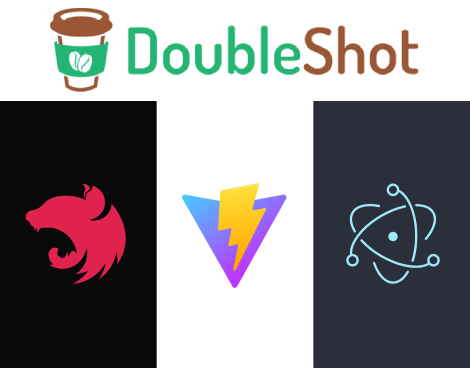

  

🧹 macOS Desktop Cleaner
This macOS Desktop Cleaner application helps you to clean your desktop by automatically removing all shortcut files (aliases) and grouping them by date in the Recycle Bin.

Built with Vite, Electron, and NestJS, this app allows you to keep your desktop tidy by handling all your shortcut files efficiently, grouping them by the date they were created, and moving them to the recycle bin for easy restoration.

🚀 Features
🧹 Automatic Desktop Cleanup: Automatically removes all shortcut files (aliases) from your macOS desktop.
📅 Grouping by Date: The desktop shortcuts are grouped into folders based on the date they were created, providing an organized cleanup.
🗑️ Recycle Bin Organization: Instead of deleting the shortcuts permanently, the application moves them to the Recycle Bin, allowing you to recover them later if necessary.
⚡ Fast Performance: Powered by Vite for fast and smooth development, and Electron for packaging as a native macOS app.
🛠️ NestJS Backend: Handles all the file system tasks like searching for desktop shortcuts, creating date-based groups, and moving them to the Recycle Bin.
🏗️ How to Use

1. Get Started
   To use the macOS Desktop Cleaner app:

Click the Use this template button (you must be logged in) or clone this repository.
In the project folder, run the following commands:
bash
Copy

# Install dependencies

yarn # or npm install

# Run in development mode (opens Electron window for testing)

yarn dev # or npm run dev

# Build for macOS production (packaging your app)

yarn build # or npm run build 2. Run the Application
Once installed, simply run the application, and it will:

Scan your desktop for shortcut files (macOS aliases).
Group the shortcuts by the date they were created (or modified).
Move all shortcuts into the Recycle Bin, grouped into folders by the date.
You can easily restore these files from the Recycle Bin if needed.

🧰 Functionality Overview

1. Desktop Shortcut Removal:
   The app scans the desktop directory for all shortcut files (macOS aliases).
   Aliases are identified and moved to the Recycle Bin instead of being deleted permanently.
2. Grouping by Date:
   Shortcuts are grouped by the creation date or last modified date.
   Each group is placed in a folder named with the respective date, making it easy to identify and manage.
3. Recycle Bin:
   Shortcuts are not permanently deleted but instead moved to the Recycle Bin for easy recovery.
   You can restore them at any time from the Recycle Bin.
4. System Integration:
   The application interacts with macOS system directories, ensuring it only handles shortcut files while leaving your regular files untouched.
   📝 Notes for macOS Users
   Permissions
   For macOS security reasons, your app may need to request file system permissions to access certain directories like the Desktop and Recycle Bin. Make sure to allow the application the necessary permissions during the installation.

Compatibility
This application is specifically optimized for macOS and works with the Desktop directory where shortcut files (aliases) are typically stored. It will not affect regular files or folders on the desktop.

⚙️ Advanced Configuration
If you're using pnpm instead of npm/yarn, you might need to adjust your .npmrc configuration:

Copy
node-linker=hoisted
Or:

arduino
Copy
public-hoist-pattern=\*
For more information on pnpm compatibility, refer to the pnpm issue discussion.

🌐 Related Resources
Blog Post: Building a macOS Desktop Cleaner with Vite + Electron + NestJS
Decorator Guide: Using Decorators to Provide a Basic API Framework for Electron
💬 Community & Support
If you encounter any issues or have questions, feel free to open an issue in the repository or reach out via the community channels.

Enjoy keeping your macOS desktop clean with this application! 🎉
